# 🤖 Blubot

This is a fully functioning Discord Bot with polling, event signups, full-blown music player + GUI, timers, and more miscellaneous applications and tools!

## 🧐 Features

Here's a rundown of a few core features...

🎮 The `.game [@role mention] [max number of players]` creates a GUI that keeps track of people signed up for a particular team. Select `add` or `remove` to add/remove yourself from the list. `perhaps` is a toggle button signaling interest, but not commitment.

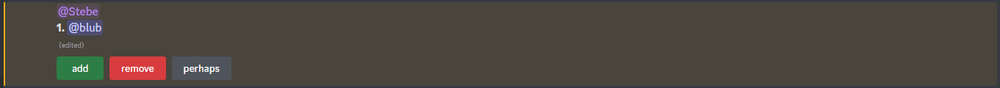

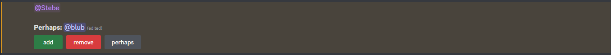

When a team is full, newcomers can no longer add themselves, so they will have to wait for somebody else currently on the roster to leave.

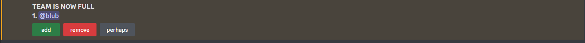

❓ The `.poll "[question] [optional: choices]` is a simple way to show a poll. Omitting any choices automatically creates a yes/no poll, while additional arguments *separated by spaces* will be considered choices. If an option has a space in it, you can encase it in quotations.

Users can only choose one choice. Clicking another choice will remove you from the current one, or you can click your current choice again to opt-out.

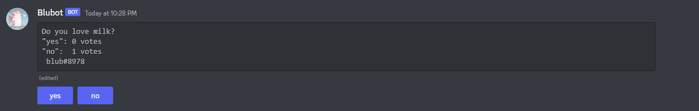

Here, I typed `.poll "Favorite Pizza Brand?" Domino's "Pizza Hut" "Papa John's"`

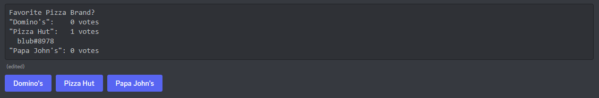

🪙 The `.cf` command simply creates a button that lets you flip a coin. Click it multiple times, and something will change...

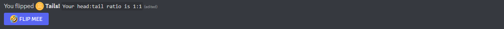

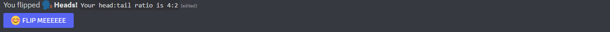

📢 Encased in the `utility.py` Cog, the `.spam [@user] [number of times]` command lets you become very annoying, perhaps for the sake of bringing to attention to somebody who frequently AFKs...

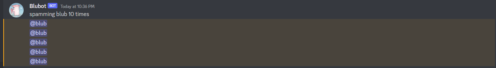

### 🎵 The Music Module 🎷

The most robust portion of the Bot, the music bot. Utilizing countless dependencies, you can simply get started by joining a voice channel, then using `.p`, `.q`, `.pn`, or discord's new slash command, `/play`.

Here, I use `/play Minecraft Background Music 5` or `.p Minecraft Background Music -5` to begin searching for the top 5 results. If the number of results is omitted, it will play the top song.

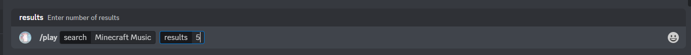

Click the button corresponding to the song you'd like to play

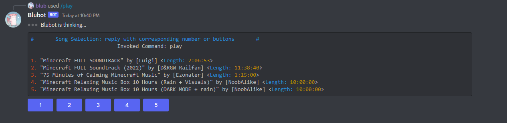

Now, use `/control` or `.ctrl` to pull up the controller/interface. It displays the current playing song, a live progress bar, timestamp, and the current queue. You may click the buttons: `back, pause/play, forward, shuffle queue, update control panel (in case it updates too slow)` or just use commands to do the same. 

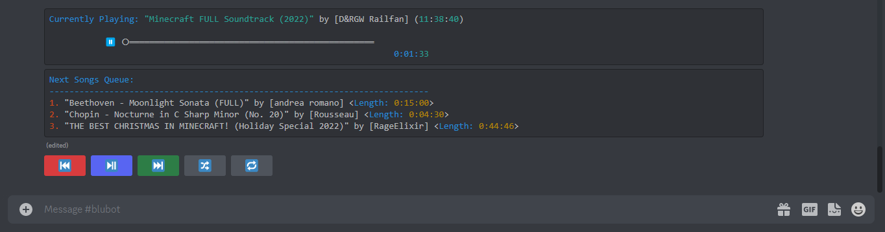

This is the list of registered slash commands.

- `/back`: go back a song
- `/clear`: clears the queue
- `/control`: brings up control panel, disables old ones
- `/help_music`: lists commands for music player
- `/leave`: leaves the channel
- `/pause`: pauses the song
- `/play`: adds selected song to front of queue
- `/playnow`: skips current song and plays selected song
- `/queue`: adds selected song to back of queue
- `/restart`: replays current song
- `/resume`: resumes the song
- `/skip`: go forward a song

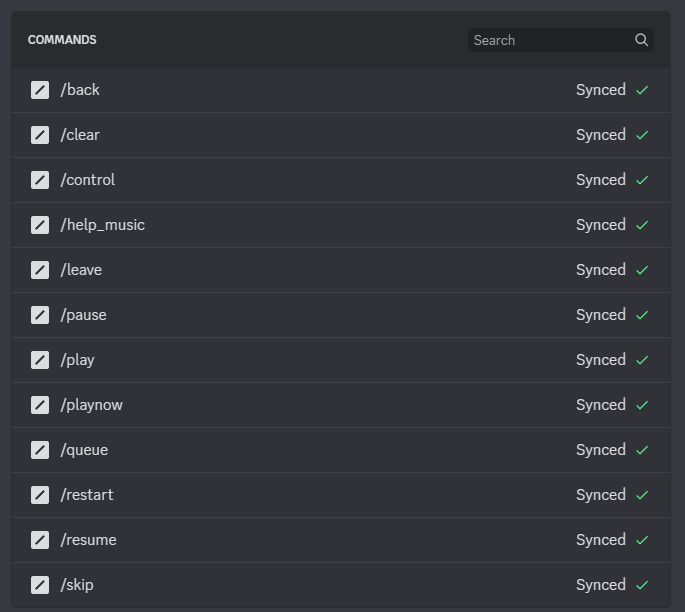

## 💪 Setting Up for Your Project

Make sure you've read [Discord's tutorial](https://discord.com/developers/docs/getting-started) on setting up your bot on discord before you try running code. This will assume your bot is registered and ready to go, or you've got a template.

### 📂 Creating a Workspace

This is somewhat optional, but creating a clean workspace without conflicting/unknown programs and dependencies minimizes possible errors

- create a clean directory and download source files OR use `git clone [repository URL]`

	- simply create a new folder of your desired location or in a terminal, type `mkdir Blubot`

	- navigate to the directory/folder

- install python's virtual environment

	- `pip install virtualenv` or `py -m pip install virtualenv` (use whichever alias is applicable for your python interpreter. PowerShell uses the alias `py`)

- set up and activate the virtual environment

	- `py -m venv env` to create the virtual environment, where `venv` is the name of the module and `env` is the name of the actual environment

	- `./env/Scripts/activate` to enter the virtual environment. Linux-based virtual environments will have a different path

### 🖊️ Dependency Requirements

If you're not using virtual environments, make sure conflicting modules such as `discord` are uninstalled before you begin. Then, install these dependencies.

`pip install [dependency]` or `py -m pip install [dependency]`

-  `py-cord`

-  `requests`

-  `youtube-dl`

-  `python-dotenv`

-  `PyNaCl`

### 🔉 FFMPEG

FFmpeg is an application that enables audio playback and gives Blubot the ability to play music. Make sure the application `ffmpeg` is downloaded.

For Windows:

- install ffmpeg

  - go to `https://www.gyan.dev/ffmpeg/builds/`

  - install `ffmpeg-git-essentials.7z` from the git master branch build

  - extract the folder with 7z and put it in desired location; We will put the folder directly in C:\ drive (and will rename to simply `ffmpeg`)

- set environment variable (so ffmpeg can be accessed)

  - go to Windows Start 🪟 and type `environment variables` to open `edit the system environment variables`

  - go to `environment variables...`

  - scroll down `system variables` list until you find the variable `Path`

  - click `Edit...` then `New`

  - type the **absolute path** of the ffmpeg executable *folder* aka "bin". Since we put the downloaded folder in the C:\ drive, the path is `C:\ffmpeg\bin`

- verify that ffmpeg was installed correctly:

  - open Command Prompt or PowerShell

  - type `ffmpeg -version` or just `ffmpeg`, and you should get some non-error response.

## 🏃‍♂️💨 Run the Project

### 👨‍💻 Configure Code

There are some minor changes you must make for the code to work, since this Bot is personalized.

- In the `main.py` file where the bot is being initialized, locate `debug_guilds`. Here you have two choices:

  1. To make the bot global, simply delete the keyword argument and the list. This is usually slow and takes minutes for Blubot to register

  2. To make it available on a few servers and for quick setup, add your own desired Server IDs in the list. Refer to [this article](https://www.alphr.com/discord-find-server-id/) to find your server id.

- Set up your API Token, the password that lets you actually control your bot. Make sure to keep it off the internet or put it somewhere safe.

  - Find your API Token in the [Developer Dashboard](https://discord.com/developers/applications)

  - Select your app > Go down to Bot > Copy or Reset your Token

  - In the Blubot directory, create a file called `.env` which will serve as your secret file

  - Type `BLUBOT_API_TOKEN = 'YOUR TOKEN HERE'` and save it. You may change the name of the variable as long as the same variable name is changed in `main.py`

Once you're in the Blubot repository, simply run the driver application:

`py .\source\main.py`

Have fun!

## ✉️ Contact

If you have questions, email me at [steven2003mao@gmail.com](mailto:steven2003mao@gmail.com)